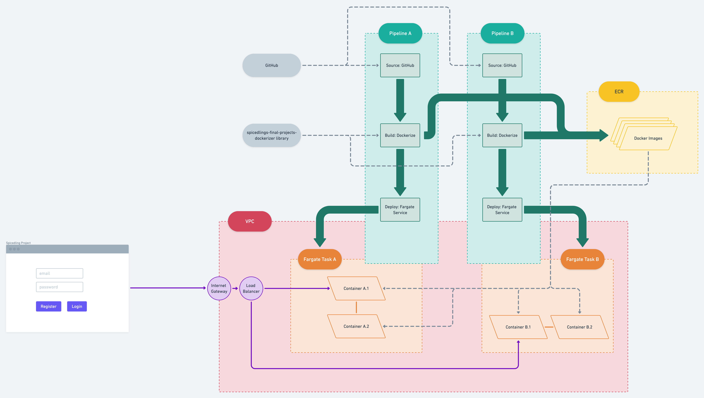

<p align="center">
	
</p>

<h1 align="center">Spicedlings Final Projects</h1>

# Overview

This is a prototype for managing and automatizing the deployment of a group of simple applications form a list of provided settings.

The resources are set up with [AWS CDK](https://aws.amazon.com/cdk/) and can be deployed entirely over the terminal.

The architecture contains two main components:

-   a core stack that sets up the VPC in which the project containers will run, and adds the Load Balancer and the HTTP Listener that will subsequently be configured to forward requests to the appropriate containers.
-   project specific resources that include a deployment pipeline, HTTP listener rules, docker images and a container orchestration service.

<p align="center">
	
</p>

---

## Quick Start

### Settings

-   Configure the settings under `settings.ts`, in particular the values:

    -   `SECRETS_MANAGER_GITHUB_TOKENS_SECRET_NAME`
    -   `DOMAIN_NAME`

-   Provide your AWS profile name under the `profile` field in `cdk.json`.

### Core Stack

```sh
npm run deploy:core
```

Read the console output for any additional action, in particular:

-   In particular provide the value for `CORE_LOAD_BALANCER_SECURITY_GROUP_ID` and `SECRETS_MANAGER_GITHUB_TOKENS_SECRET_NAME` in `setting.ts`

### Projects

Choose your deployment by running:

```sh
npm run deploy:spicedling
```


Follow instructions from the terminal and add secrets to the secrets manager as needed

A full project deployment consists in three Cloud Formation stacks and can be deployed with the following steps:

-   `Pipeline [Part I]`
-   `Fargate Service`
-   `Pipeline [Part II]`
